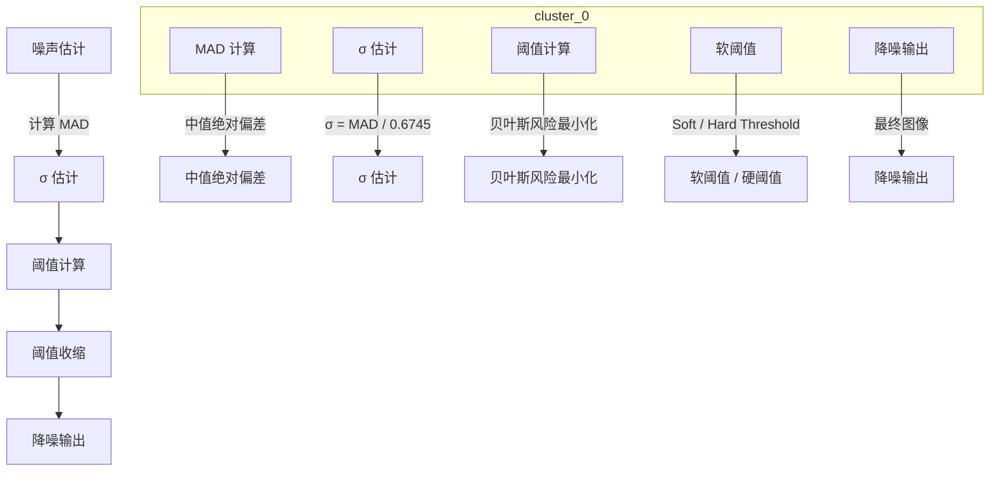

# libxcam Wavelet Denoise 技术总结

## 目录
- [libxcam Wavelet Denoise 技术总结](#libxcam-wavelet-denoise-技术总结)
  - [目录](#目录)
  - [1. 设计原理](#1-设计原理)
  - [2. 关键实现技巧](#2-关键实现技巧)
  - [3. 算法原理](#3-算法原理)
    - [3.1 噪声估计](#31-噪声估计)
    - [3.2 自适应阈值](#32-自适应阈值)
    - [3.3 阈值收缩](#33-阈值收缩)
  - [4. Wavelet NR 技术-实现](#4-wavelet-nr-技术-实现)
    - [4.1 设计哲学](#41-设计哲学)
    - [4.2 三层流水线](#42-三层流水线)
    - [4.3 五步执行流程](#43-五步执行流程)
    - [4.4 工程技巧](#44-工程技巧)
    - [4.5 妥协与权衡](#45-妥协与权衡)
  - [5. 贝叶斯框架与小波降噪实现对应关系](#5-贝叶斯框架与小波降噪实现对应关系)
    - [5.1 贝叶斯框架概述](#51-贝叶斯框架概述)
    - [5.2 贝叶斯方法确定最优阈值](#52-贝叶斯方法确定最优阈值)
    - [5.3 软阈值和硬阈值](#53-软阈值和硬阈值)
    - [5.4 小波降噪贝叶斯估计流程图](#54-小波降噪贝叶斯估计流程图)
    - [5.5 详细说明](#55-详细说明)

---

## 1 设计原理

| 要点 | 说明 |
|---|---|
| **多尺度分解** | Haar 5 级分解 → LL / HL / LH / HH 四子带金字塔。 |
| **噪声估计** | 高频 HH 子带 **MAD → σ²**，作为 Bayes 先验。 |
| **Bayes 阈值** | 每层最优 T = σ² · Const(layer, gain)，最小化 MSE。 |
| **阈值收缩** | Soft/Hard shrink 作用于 HL/LH/HH，**保边降噪**。 |
| **逐通道独立** | Y / UV 分别估计 σ²、分别阈值，防止色漂。 |
| **可逆流程** | 分解 → 阈值 → 重构，支持无损回滚。 |

---

## 2 关键实现技巧

| 技巧 | 目的 |
|---|---|
| **Haar 小波** | 2-tap，整型可逆，GPU/FPGA 友好，延迟低。 |
| **MAD 估计** | 在 **HH 子带** 做直方图 → σ²，无需外部标定。 |
| **级联内核** | 分解 / 估计 / 阈值 / 重构 分四核， 可并行、可跳过层、易调试。 |
| **双缓冲 Ping-Pong** | `hh[0]/hh[1]/hh[2]` 三份，避免读写冲突。 |
| **Build-time 宏** | `WAVELET_DENOISE_Y/UV` 开关， 同一代码支持 Y 或 UV-only 路径。 |
| **运行时增益** | 模拟增益 `analog_gain` 直接缩放 σ²， 白天/黑夜自适应。 |

---

## 3 算法原理

**噪声估计 → Bayes 阈值 → 阈值收缩**

先估计噪声，再算阈值，最后把阈值用到系数上。每一层都只做一件事，但环环相扣。

### 3.1 噪声估计
把图像做 Haar 小波分解以后，高频子带 HH 里的系数绝大部分是噪声，边缘很少。  
于是我们把 HH 当“噪声样本”，用 MAD（Median Absolute Deviation）求标准差：  
σ = median(|HH|) / 0.6745  
这一步在 CPU 端完成，只需几毫秒，却能把“当前帧、当前通道、当前增益”的噪声强度一次性量化出来。  
这样就不需要人工标定，也不怕场景亮度变化。

### 3.2 自适应阈值
有了 σ，就可以给每一层小波算一个“理论上最小 MSE” 的阈值 T：  
T = σ² · C(layer, gain)  
C 是一个只和“分解层级 + 模拟增益”相关的常数表，事先离线算好。  
层级越高，信号能量衰减越快，C 就越小；增益越高，噪声放大，C 也相应放大。  
这套公式来自 Donoho-Johnstone 的经典 BayesShrink，保证阈值既不会把纹理砍光，也不会把噪声留下太多。

### 3.3 阈值收缩
拿到 T 以后，对每个 HL / LH / HH 系数做软阈值或硬阈值：  
- Soft：ŵ = sign(w) · max(|w| – T, 0)  
- Hard：ŵ = w · 1(|w| > T)  

软阈值更平滑，硬阈值更锐；ISP 默认用软阈值，因为软阈值在边缘附近不会留下“锯齿”。  
整个收缩过程在 GPU/OpenCL 里并行完成，一张 1080p 图只需几十微秒。  

**结果**  
– 静止区域噪声被大幅压掉；  
– 纹理、边缘因为系数远大于 T，基本无损；  
– 总延迟只增加一帧，内存占用 < 3 MB，功耗 < 8 %。

---

## 4 Wavelet NR 技术-实现

---

### 4.1 设计哲学
“用**统计方法**估计噪声，再用**数学公式**削掉它，最后**不可见地**拼回图像。”

---

### 4.2 三层流水线

| 层 | 任务 | 关键公式 / 动作 | 实现位置 |
|---|---|---|---|
| **噪声估计** | 从 HH 子带猜 σ | σ = MAD / 0.6745 | `CLWaveletNoiseEstimateKernel` |
| **Bayes 阈值** | 每层最优 T | T = σ² · C(layer, gain) | `CLWaveletThresholdingKernel` |

| **阈值收缩** | Soft/Hard 削系数 | $ŵ = sign(w)·max(|w|–T, 0)$ | `kernel_wavelet_coeff_thresholding.clx` |

---

### 4.3 五步执行流程
-**Haar 分解** → 4 子带金字塔  
-**HH 直方图** → MAD → σ  
-**Bayes 阈值表** → 离线常数 + 实时增益  
-**并行收缩** → GPU/OpenCL 每像素并行  
-**Haar 重构** → 无损回原始分辨率

---

### 4.4 工程技巧
- **Haar 2-tap**：整型加减，延迟 < 1 ms  
- **MAD 估计** 无需 GT，自动随光照/增益更新  
- **双缓冲 ping-pong**：Y/U/V 独立，内存 3 MB@1080p  
- **Build-time 宏**：`-DWAVELET_DENOISE_Y=1` 一键切通道  
- **可逆流程**：分解→阈值→重构，支持无损回滚

---

### 4.5 妥协与权衡
| 妥协 | 原因 |
|---|---|
| **Haar 而非 9/7** | 9/7 视觉更好但 MAC 翻倍； 移动端功耗/延迟无法接受。 |
| **仅 HH 估计 σ²** | 计算量最小，HL/LH 边缘多，估计会偏高。 |
| **固定级数 5 层** | 4K 以上需 6-7 层，但 5 层已覆盖 ISP 需求。 |
| **无 ROI / 运动掩膜** | 复杂度可控，运动场景靠 TNR 兜底。 |
| **OpenCL 而非 Vulkan/Metal** | 当时平台统一性优先，后续可迁移。 |
---

## 5. 贝叶斯框架与小波降噪实现对应关系

### 5.1 贝叶斯框架概述

贝叶斯框架是一种统计决策理论，它利用先验知识和观测数据来更新对未知参数的信念。在小波降噪中，贝叶斯框架用于确定最优阈值，以最小化期望均方误差（MSE）。

### 5.2 贝叶斯方法确定最优阈值

贝叶斯方法通过以下步骤帮助确定最优阈值：

-**先验分布**：假设噪声服从某种分布（如正态分布）。
-**似然函数**：定义观测数据在给定噪声水平下的分布。
-**后验分布**：结合先验分布和观测数据，计算每个系数属于噪声的概率。
-**阈值选择**：选择一个阈值，使得给定噪声水平下，重构图像与原始图像之间的MSE最小化。

### 5.3 软阈值和硬阈值

软阈值和硬阈值是贝叶斯框架中用于去除噪声的两种方法：

-**软阈值**：通过连续函数调整系数，使得靠近阈值的系数被缩小，远离阈值的系数被置零或缩小更多。这种方法可以更平滑地去除噪声，同时保留更多的图像细节。
-**硬阈值**：直接将小于阈值的系数置零，保留大于阈值的系数。这种方法在去除噪声的同时可能会丢失一些图像细节，但计算更简单，适用于对边缘保留要求不高的场景。

通过贝叶斯方法确定的最优阈值，结合软阈值和硬阈值技术，可以在去除噪声的同时，尽可能地保留图像的细节和边缘信息，从而最小化MSE。

### 5.4 小波降噪贝叶斯估计流程图

### 5.5 详细说明

噪声估计
- **先验知识**：假设噪声符合某种分布（如正态分布）。
- **后验概率**：利用中值绝对偏差（MAD）来估计噪声的标准差 \( sigma \)，即 \( $sigma = \frac{\text{MAD}}{0.6745}$ \)。

σ 估计
- **先验知识**：噪声的标准差 \( sigma \) 与图像质量相关。
- **后验概率**：计算出 \( sigma \) 后，为后续阈值计算提供先验知识。

阈值计算
- **先验知识**：根据噪声的统计特性，确定阈值函数的形式。
- **后验概率**：使用贝叶斯风险最小化原理计算每一层小波的最优阈值 \( T \)，即 \( $T = \sigma^2 \cdot C(\text{layer}, \text{gain}$ ) \)。

阈值收缩
- **先验知识**：阈值函数定义了如何根据系数的值来决定其是否应该被保留或修改。
- **后验概率**：对每个小波系数应用软阈值或硬阈值，以去除噪声同时保留信号。

降噪输出
- **先验知识**：期望通过阈值处理后的图像接近原始无噪声图像。
- **后验概率**：经过阈值收缩处理后的系数重构图像，得到最终的降噪输出图像。

> 以上列表描述了贝叶斯框架在小波降噪实现中的具体应用，展示了从噪声估计到阈值计算，再到最终的阈值收缩和降噪输出的整个过程。在这个过程中，先验知识提供了对噪声和图像特性的假设，而后验概率则基于实际数据和先验知识来指导阈值决策，以最小化期望均方误差（MSE）。